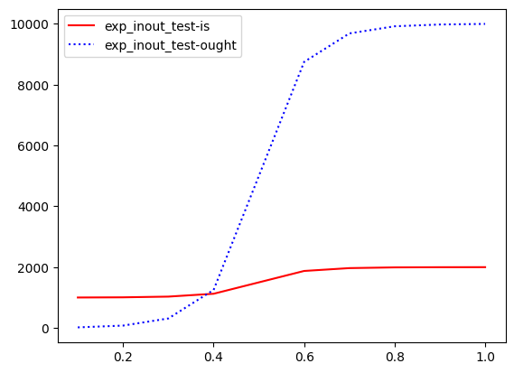

# `easing-fixed`: fixed-point easing iterators for rust

This is a fork of https://github.com/joliv/easing which uses [fixed-point](https://crates.io/crates/fixed) math instead. `no_std` compatible.

## Development

The test cases define an acceptable error margin (`ERROR_MARGIN_FAC`) and every test case stepping outside of that threshold gets its "is" and "ought" data written to `jupyter-tests/<name of test>-{is,ought}.json`. In there, you can use the supplied `tests.ipynb` notebook for a visualized representation of the failure:



The JSON files get cleared out by `build.rs`. Sadly on every build, not just during tests, as cfg-gating for `test` is not possible there.

## (mostly preserved) original README below

Rust iterators are fantastic—why not use them for easing? Use like so:

```rust
use easing_fixed as easing;

let begin: f64 = 0;
let end:   f64 = 1000;
let steps: u64 = 10;

// In a for loop!
for x in easing::sin_in(begin, end, steps) {
    println!("Woo, I'm at x={}!", x);
}

// Mapping!
fn move_to(x: f64) {
    println!("Moving on up to {}", x);
}
easing::cubic_out(begin, end, steps).map(move_to);

// And other iterator stuff!
let xs: Vec<f64> = easing::exp_inout(begin, end, steps).collect(); // why would you do this
```

Available iterators are currently:

| function | in | out | in and out |
|----------|----|-----|-------|
| linear | `linear` | `linear` | `linear` |
| quadratic | `quad_in` | `quad_out` | `quad_inout` |
| cubic | `cubic_in` | `cubic_out` | `cubic_inout` |
| quartic | `quartic_in` | `quartic_out` | `quartic_inout` |
| sinusoidal | `sin_in` | `sin_out` | `sin_inout` |
| exponential | `exp_in` | `exp_out` | `exp_inout` |

Easing functions taken from [warrenm's AHEasing](https://github.com/warrenm/AHEasing).
